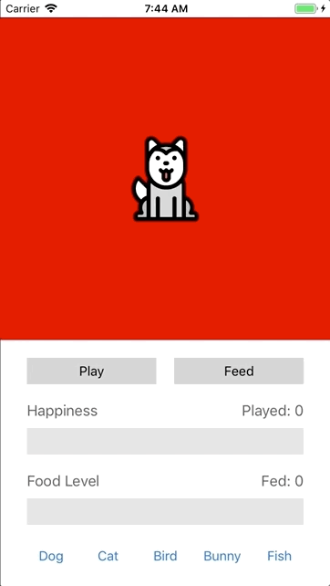
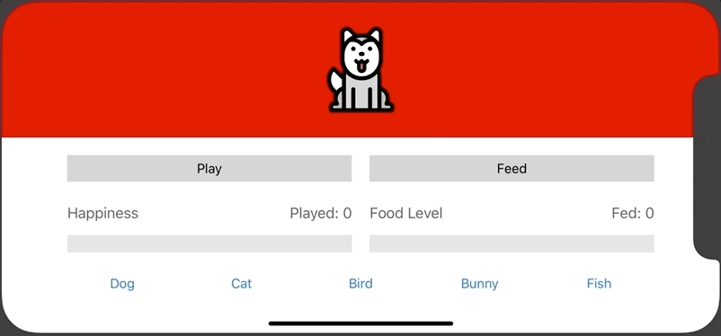

# # Fall 2018 :: CSE 438 Lab 2 - Virtual Pet App
It is an app that allows users to play with their virtual pets. This lab focuses on the Auto Layout and MVC pattern. 

# # Build Environment
  - Xcode 9.4
  - Swift 4
  - Supports every device and orientation (Universal)

# # Features
  - Five pets can be fed and played with, and their values update appropriately.
  - Each pet has a custom image and color. Switching between pets updates the image, background color, and color of each display bar.
  - The display bars animate when the pet is played or fed, but jump immediately to the correct values when switching between pets.
  - When users press either “Play” or “Feed” button, based on the current pet, users can hear the sound of the corresponding pet.
  - When users press the “Play” button when the current pet’s food level is 0, the pet will move to the left and right two times, expressing dislike.
  - When the food level reaches the maximum value, the pet will jump and make a jumping sound, expressing excitement.
 
# # Design Choices
  - A pet can only be played when its food level is greater than 0. 
  - When played, the happiness level is incremented by 1, and the food level is decremented by 1. 
  - When fed, the happiness level stays the same, and the food level is incremented by 1.
  - However, if a user tries to keep feeding when the food level is full, its happiness level starts to decrease. 
  - The default pet is a dog.

# # References
  - Sound files are from https://www.salamisound.com
  - Images and animated bar is given.

# # Demo
> The following demo shows the basic functionality of this app.  
>   
>   
>
> The following demo shows that the app also supports iPhone X and landscape mode.  
>   
> 
